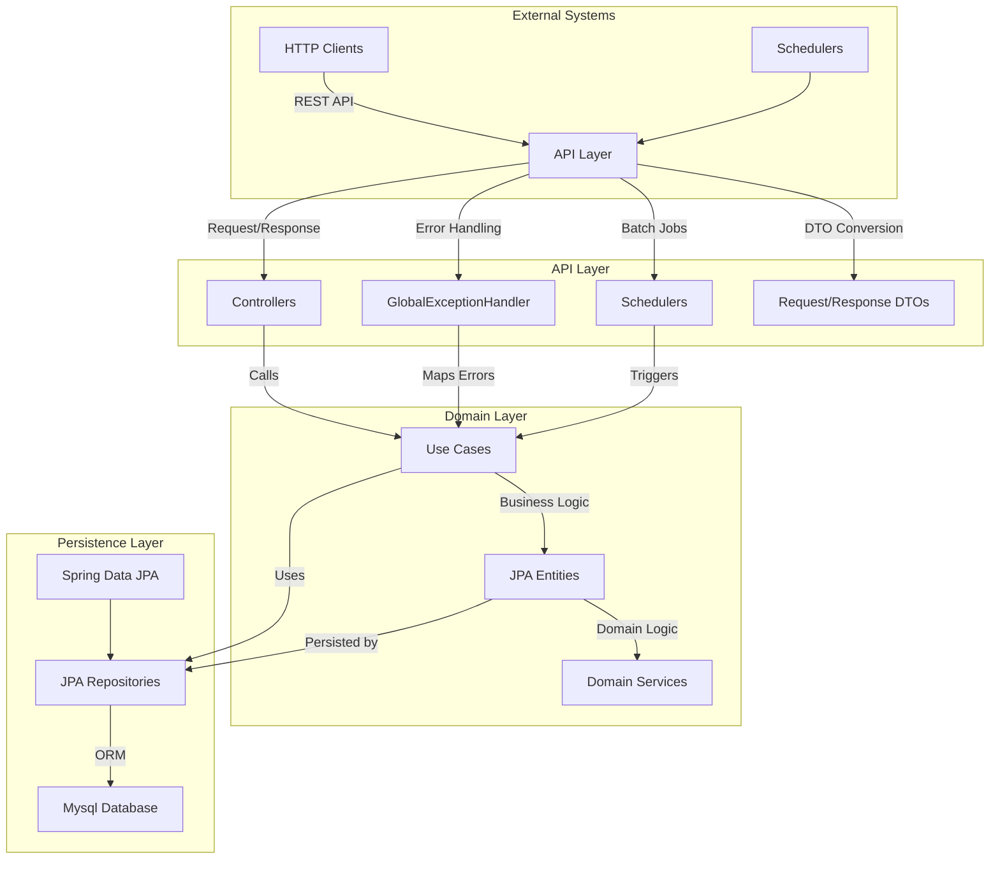

# 이커머스 플랫폼 서버

## 프로젝트 개요

이커머스 플랫폼의 핵심 기능을 구현한 Spring Boot 애플리케이션입니다. JPA와 Mysql 데이터베이스를 활용하여 실제 운영 환경에 가까운 구조로 설계되었습니다.

### 핵심 도메인

- **User**: 사용자 정보 관리 (기본 정보)
- **Product**: 상품 정보 및 2단계 재고 관리 (stock + reserved_stock)
- **Order**: 주문 생성, 상태 관리, 주문 아이템 관리
- **Balance**: 사용자 잔액 관리 (낙관적 락 적용)
- **Payment**: 결제 처리 및 상태 관리
- **Coupon**: 쿠폰 발급, 사용, 만료 처리
- **CouponHistory**: 쿠폰 사용 이력 추적

### 주요 특징

- **JPA & Mysql 데이터베이스**: 실제 RDBMS 환경에서 동작하는 영속성 계층
- **동시성 제어**: JPA 낙관적 락(@Version)과 비즈니스 락을 조합한 안전한 동시성 처리
- **상태 기반 설계**: Enum을 활용하여 명확한 상태 전이 관리
- **2단계 재고 관리**: Product Entity 내 stock과 reserved_stock으로 안전한 재고 처리
- **통합 테스트**: @SpringBootTest와 TestContainers를 활용한 실제 DB 환경 테스트
- **API 문서화**: Swagger를 통한 자동 API 문서 생성
- **배치 처리**: @Scheduled를 통한 쿠폰 만료 등 주기적 작업 수행

## 아키텍처 개요

JPA를 기반으로 한 계층형 아키텍처를 채택하여 도메인 중심의 설계를 구현했습니다. Entity에는 비즈니스 로직이 포함되어 있으며, Repository 패턴을 통해 데이터 액세스를 추상화했습니다.

### 아키텍처 다이어그램



### 의존성 흐름

```
External → API Layer → Domain Layer (Use Cases → JPA Entities)
↓
JPA Repositories ← Mysql Database
```

### 핵심 원칙

- 도메인 로직은 JPA Entity에 캡슐화
- Repository 패턴으로 데이터 접근 추상화
- 트랜잭션 경계를 UseCase 레벨에서 관리

### 적용 이유

- JPA의 강력한 ORM 기능으로 객체-관계 매핑 자동화
- 실제 데이터베이스 환경에서의 성능 및 동시성 검증 가능
- Spring Data JPA로 반복적인 CRUD 코드 제거
- 테스트 환경에서 실제 DB 트랜잭션 동작 검증

## 레이어별 책임과 역할

### 1. API Layer (`kr.hhplus.be.server.api`)

**책임**:

- REST API 엔드포인트 제공
- 요청/응답 DTO 변환 및 검증
- 전역 예외 처리로 일관된 에러 응답 생성
- Swagger 기반 API 문서 자동 생성 및 검증
- @Scheduled를 통한 배치 작업 실행
- 성공 응답 표준화(@ControllerAdvice 활용)

**구성**:

```
api/
├── controller/          # REST API 컨트롤러
│   ├── BalanceController.java
│   ├── CouponController.java
│   ├── OrderController.java
│   └── ProductController.java
├── dto/                 # 요청/응답 DTO
│   ├── request/
│   └── response/
├── docs/                # Swagger 문서화 설정
│   ├── annotation/      # API 문서 어노테이션
│   ├── config/          # Swagger 설정
│   └── schema/          # 스키마 정의
├── scheduler/           # 배치 작업
├── CommonResponse.java  # 표준 응답 포맷
├── ErrorCode.java       # 에러 코드 정의
├── GlobalExceptionHandler.java # 전역 예외 처리
└── SuccessResponseAdvice.java  # 성공 응답 표준화
```

**적용 이유**:

- HTTP 처리와 비즈니스 로직 분리로 유지보수성 향상
- Swagger 자동 문서화로 API 스펙 관리 효율성 증대
- 표준화된 응답 포맷으로 클라이언트 개발 편의성 제공
- 전역 예외 처리로 일관된 에러 응답 보장

### 2. Domain Layer (`kr.hhplus.be.server.domain`)

**책임**:

- JPA Entity 기반 도메인 모델 정의
- 비즈니스 규칙 및 정책을 Entity 메서드로 구현
- Enum 기반 상태 전이 관리 및 검증
- UseCase를 통한 비즈니스 로직 조합
- 도메인 예외 정의 및 처리
- Repository 인터페이스 정의 (JPA Repository 확장)

**구성**:

```
domain/
├── entity/              # JPA 엔티티
│   ├── Balance.java     # 잔액 (낙관적 락 적용)
│   ├── Coupon.java      # 쿠폰
│   ├── CouponHistory.java # 쿠폰 사용 이력
│   ├── Order.java       # 주문
│   ├── OrderItem.java   # 주문 아이템
│   ├── Payment.java     # 결제
│   ├── Product.java     # 상품 (재고 포함)
│   └── User.java        # 사용자
├── enums/               # 도메인 상태 Enum
├── exception/           # 도메인 예외
├── port/                # Repository 인터페이스
│   └── storage/         # JPA Repository 인터페이스
└── usecase/             # 비즈니스 로직 조합
    ├── balance/
    ├── coupon/
    ├── order/
    └── product/
```


### 3. Persistence Layer (`kr.hhplus.be.server.adapter.storage`)

**책임**:

- JPA Repository 구현체 제공
- Mysql 데이터베이스와의 실제 연동
- 복잡한 쿼리 및 데이터 접근 로직 구현
- 트랜잭션 관리 및 영속성 컨텍스트 처리

**구성**:

```
adapter/storage/
├── jpa/                    # JPA Repository 구현
│   ├── BalanceJpaRepository.java
│   ├── CouponJpaRepository.java
│   ├── OrderJpaRepository.java
│   └── ... (기타 JPA Repository)
└── inmemory/              # 테스트용 In-Memory 구현
    ├── InMemoryBalanceRepository.java
    └── ... (기타 In-Memory Repository)
```

**적용 이유**:

- JPA의 강력한 ORM 기능으로 SQL 작성 부담 감소
- Spring Data JPA의 쿼리 메서드로 개발 생산성 향상
- 실제 데이터베이스 환경에서 성능 및 제약조건 검증

### 4. Configuration Layer (`kr.hhplus.be.server.config`)

**책임**:

- Spring Boot Auto Configuration 활용
- JPA 및 Mysql 데이터베이스 설정
- 스케줄링 활성화 설정
- 테스트 환경별 프로필 관리

**적용 이유**:
- Spring Boot의 Convention over Configuration 활용
- 최소한의 설정으로 최대 효과 달성
- 프로필 기반 환경별 설정 관리

## 도메인 설계

### 1. Coupon 도메인

**핵심 로직**:

- Enum 기반 쿠폰 상태 관리
- 발급 가능 여부 확인
- 재고 감소 및 상태 자동 업데이트

```java
public enum CouponStatus {
    INACTIVE,  // 발급 전
    ACTIVE,    // 발급 가능
    SOLD_OUT,  // 재고 소진
    EXPIRED,   // 만료
    DISABLED   // 비활성화
}
```

```java
public class Coupon {
    public boolean canIssue() {
        LocalDateTime now = LocalDateTime.now();
        CouponStatus currentStatus = calculateStatus(now);
        return currentStatus.isIssuable();
    }

    public void decreaseStock(int quantity) {
        if (this.issuedCount + quantity > this.maxIssuance) {
            throw new CouponException.CouponStockExceeded();
        }
        
        this.issuedCount += quantity;
        
        // 재고 소진 시 상태 업데이트
        if (this.issuedCount >= this.maxIssuance) {
            updateStatus(CouponStatus.SOLD_OUT);
        }
    }
    
    public void updateStatusBasedOnConditions() {
        LocalDateTime now = LocalDateTime.now();
        CouponStatus newStatus = calculateStatus(now);
        
        if (this.status != newStatus && this.status.canTransitionTo(newStatus)) {
            this.status = newStatus;
        }
    }
}
```

**적용 이유**:

- Enum으로 상태 전이 명확히 정의하여 버그 감소
- 엔티티 내 비즈니스 로직 캡슐화로 응집도 향상
- 도메인 예외로 비즈니스 규칙 위반 명확히 처리

### 2. Product 도메인 - 2단계 재고 관리

**핵심 로직**:

- 주문 시 재고 예약
- 결제 완료 시 재고 확정

```java
public class Product {
    private int stock;
    private int reservedStock;

    public void reserveStock(int quantity) {
        validateQuantity(quantity);
        
        if (!hasAvailableStock(quantity)) {
            throw new ProductException.OutOfStock();
        }
        
        this.reservedStock += quantity;
    }

    public void confirmReservation(int quantity) {
        validateQuantity(quantity);
        
        if (this.reservedStock < quantity) {
            throw new ProductException.InvalidReservation("Cannot confirm more than reserved quantity");
        }
        
        if (this.stock < quantity) {
            throw new ProductException.InvalidReservation("Cannot confirm reservation due to insufficient actual stock");
        }
        
        this.stock -= quantity;
        this.reservedStock -= quantity;
    }

    public boolean hasAvailableStock(int quantity) {
        return (this.stock - this.reservedStock) >= quantity;
    }
    
    public void cancelReservation(int quantity) {
        validateQuantity(quantity);
        
        if (this.reservedStock < quantity) {
            throw new ProductException.InvalidReservation("Cannot cancel more than reserved quantity");
        }
        
        this.reservedStock -= quantity;
    }
}
```

**적용 이유**:

- 예약-확정 분리로 결제 실패 시 재고 복원 간단
- 동시 요청에서 재고 안정성 보장
- 메서드명으로 의도 명확히 전달

### 상태 전이

**예시: 쿠폰 상태 전이 규칙**

```java
public boolean canTransitionTo(CouponStatus newStatus) {
    switch (this) {
        case INACTIVE: return newStatus == CouponStatus.ACTIVE || newStatus == CouponStatus.EXPIRED || newStatus == CouponStatus.DISABLED;
        case ACTIVE: return newStatus == CouponStatus.SOLD_OUT || newStatus == CouponStatus.EXPIRED || newStatus == CouponStatus.DISABLED;
        case SOLD_OUT: return newStatus == CouponStatus.EXPIRED || newStatus == CouponStatus.DISABLED;
        case EXPIRED: return newStatus == CouponStatus.DISABLED;
        case DISABLED: return newStatus == CouponStatus.ACTIVE;
        default: return false;
    }
}
```

**적용 이유**:

- 상태 전이 규칙 명시로 무효 전이 방지
- Enum 기반 관리로 코드 가독성과 안정성 향상

## 기술 선택과 적용 이유

### 1. 헥사고날 아키텍처

**적용 이유**:
- 이커머스의 복잡한 비즈니스 로직(주문, 결제, 쿠폰)을 기술적 세부사항과 분리
- 외부 시스템 변경 시 도메인 코드 수정 불필요
- Mock 포트를 활용한 단위 테스트로 품질 보장

**대안 비교**:
- 레이어드 아키텍처는 의존성 방향 명확하나 기술 변경 시 서비스 코드 수정 필요
- 헥사고날 아키텍처는 기술 독립성과 확장성 우수

### 2. JPA & Mysql 데이터베이스
- 실제 SQL과 관계형 데이터베이스 제약조건 활용
- JPA의 1차 캐시, Dirty Checking 등 최적화 기능 사용
- 복잡한 쿼리와 조인 연산의 실제 성능 측정 가능
- 테스트 환경에서도 실제 트랜잭션 동작 검증

```java
// JPA Repository 활용 예시
@Repository
public interface CouponJpaRepository extends JpaRepository<Coupon, Long> {
    
    @Query("SELECT c FROM Coupon c WHERE c.status = :status AND c.endDate > :now")
    List<Coupon> findActiveCoupons(@Param("status") CouponStatus status, 
                                  @Param("now") LocalDateTime now);
    
    @Modifying
    @Query("UPDATE Coupon c SET c.status = :newStatus WHERE c.endDate < :now AND c.status = :oldStatus")
    int updateExpiredCoupons(@Param("newStatus") CouponStatus newStatus,
                            @Param("oldStatus") CouponStatus oldStatus,
                            @Param("now") LocalDateTime now);
}
```

### 3. JPA 낙관적 락 구현
- `@Version` 어노테이션으로 동시성 제어

```java
@Entity
public class Balance {
    @Version
    private Long version;  // JPA가 자동으로 관리
    
    public void addAmount(BigDecimal amount) {
        validateAmount(amount);
        this.amount = this.amount.add(amount);
        // 저장 시 version이 자동으로 증가하고 충돌 시 OptimisticLockingFailureException 발생
    }
}
```

**JPA와 Mysql 데이터베이스 활용**:

- 실제 관계형 데이터베이스(Mysql)를 사용하여 프로덕션 환경과 유사한 테스트 가능
- JPA의 `@Version` 어노테이션으로 낙관적 락 구현 (Balance 엔티티에 적용)
- `@Entity`, `@Table`, `@Column` 등 JPA 어노테이션이 실제로 동작
- 복잡한 연관관계 매핑과 Lazy Loading 검증 가능
- 트랜잭션 롤백, 영속성 컨텍스트 등 JPA 핵심 기능 활용

### 4. 2단계 재고 관리

- 동시 주문 시 재고 초과 방지
- 결제 실패 시 예약 취소로 재고 안정성 유지
- 단계적 처리로 코드 의도 명확

### 5. 중앙집중식 에러 처리

- 에러 코드와 HTTP 상태 매핑으로 클라이언트 응답 일관성 유지
- 도메인별 에러 정의로 디버깅 효율성 향상
- `@ControllerAdvice`로 예외 처리 중앙화

```java
public enum ErrorCode {
    USER_NOT_FOUND("U001", "사용자를 찾을 수 없습니다."),
    COUPON_EXPIRED("C002", "만료된 쿠폰입니다."),
    PRODUCT_OUT_OF_STOCK("P002", "상품 재고가 부족합니다.");
    
    private final String code;
    private final String message;
    
    public String getMessage() {
        return message;
    }
    
    public static HttpStatus getHttpStatusFromErrorCode(ErrorCode errorCode) {
        // HTTP 상태 코드 매핑 로직
        return ERROR_CODE_HTTP_STATUS_MAP.get(errorCode);
    }
}
```

### 6. 배치 처리

- 쿠폰 만료 체크를 요청마다 수행 시 성능 저하
- 스케줄러로 트래픽 낮은 시간대에 일괄 처리
- 트랜잭션 단위로 데이터 일관성 보장

```java
@Scheduled(cron = "0 0 * * * *")
public void expireCoupons() {
    expireCouponsUseCase.execute();
}
```

## 주요 기능

- **사용자 잔액 관리**: 잔액 충전, JPA 낙관적 락을 통한 동시성 제어
- **상품 관리**: 상품 조회, Product Entity 내 2단계 재고 관리 (stock + reserved_stock)
- **주문 및 결제**: 재고 예약 후 결제, 쿠폰 적용, 복합 주문 조회
- **쿠폰 시스템**: 쿠폰 발급(중복 방지), 사용 이력 추적, 배치 만료 처리
- **결제 처리**: 주문별 결제 상태 관리 및 이력 추적
- **동시성 제어**: JPA 낙관적 락과 트랜잭션을 통한 데이터 일관성 보장

## API 문서

애플리케이션 실행 후 `http://localhost:8080/swagger-ui/index.html`에서 상세한 API 문서를 확인할 수 있습니다.

**주요 API 엔드포인트**:

### 잔액 관리

- **POST /api/balance/charge**: 잔액 충전
- **GET /api/balance/{userId}**: 잔액 조회

### 상품

- **GET /api/product/list**: 상품 목록 조회 (페이지네이션 지원)
- **GET /api/product/popular**: 인기 상품 목록 (최근 N일간)

### 주문

- **POST /api/order**: 주문 생성
- **POST /api/order/{orderId}/pay**: 주문 결제
- **GET /api/order/{orderId}**: 주문 조회
- **GET /api/order/user/{userId}**: 사용자 주문 목록

### 쿠폰

- **POST /api/coupon/issue**: 쿠폰 발급
- **GET /api/coupon/{userId}**: 보유 쿠폰 조회

## 테스트

### 테스트 구조

```
src/test/java/
├── integration/                    # 통합 테스트 (@SpringBootTest)
│   ├── BalanceTest.java           # 잔액 관리 통합 테스트
│   ├── CouponTest.java            # 쿠폰 시스템 통합 테스트
│   ├── OrderTest.java             # 주문/결제 통합 테스트
│   ├── PaymentTest.java           # 결제 처리 통합 테스트
│   └── ProductTest.java           # 상품 관리 통합 테스트
├── unit/                          # 단위 테스트
│   ├── controller/                # 컨트롤러 단위 테스트
│   ├── facade/                    # 파사드 레이어 테스트
│   └── usecase/                   # 유스케이스 단위 테스트
│       ├── balance/
│       ├── order/
│       └── ... (기타 도메인)
└── TestcontainersConfiguration.java # 테스트 컨테이너 설정
```

### 테스트 전략

- **통합 테스트**: `@SpringBootTest`로 실제 Spring 컨텍스트와 Mysql DB 사용
- **단위 테스트**: UseCase 및 Controller 레이어별 독립 테스트  
- **동시성 테스트**: `ExecutorService`를 활용한 멀티스레드 환경 검증
- **JPA 테스트**: 실제 데이터베이스 제약조건 및 트랜잭션 동작 검증
- **API 문서 검증**: Swagger 설정과 실제 API 동작 일치성 확인
