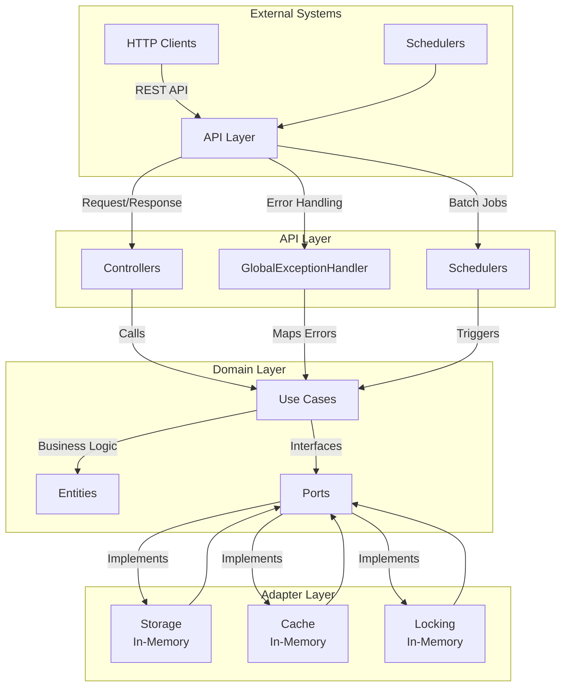

# 이커머스 플랫폼 서버

## 프로젝트 개요

### 핵심 도메인

- **User**: 사용자 정보 관리
- **Product**: 상품 정보 및 재고 관리
- **Order**: 주문 생성, 결제, 상태 관리
- **Balance**: 사용자 잔액 관리
- **Coupon**: 쿠폰 발급, 사용, 만료 처리

### 주요 특징

- **헥사고날 아키텍처**: 비즈니스 로직과 외부 시스템을 분리하여 테스트 용이성과 확장성 확보
- **동시성 제어**: 인메모리 락을 활용하여 동시 요청 처리의 안정성 보장
- **상태 기반 설계**: Enum을 활용하여 명확한 상태 전이 관리
- **2단계 재고 관리**: 예약-확정 방식으로 재고 안정성 유지
- **중앙집중식 에러 처리**: 일관된 에러 코드와 HTTP 상태 매핑
- **배치 처리**: 스케줄링을 통한 쿠폰 만료 등 주기적 작업 수행

## 아키텍처 개요

헥사고날 아키텍처를 채택하여 비즈니스 로직을 중심에 두고 외부 시스템과의 연결을 포트와 어댑터로 처리한다. 도메인 로직은 외부 기술에 의존하지 않아 데이터베이스나 캐시 변경 시 코드 수정이 최소화된다.

### 아키텍처 다이어그램



### 의존성 흐름

```
External → API Layer → Domain Layer (Use Cases → Entities)
↓
Ports ← Adapter Layer
```

### 핵심 원칙

- 의존성은 외부에서 내부로 단방향 유지
- 도메인 레이어는 기술적 세부사항과 독립
- 포트를 통해 의존성 역전 구현

### 적용 이유

- 외부 시스템 변경(예: 데이터베이스 교체) 시 도메인 로직 수정 불필요
- 포트 인터페이스를 Mock하여 단위 테스트 간소화
- 새로운 외부 시스템 통합 시 어댑터 추가로 확장 가능

## 레이어별 책임과 역할

### 1. API Layer (`kr.hhplus.be.server.api`)

**책임**:

- REST API 엔드포인트 제공
<<<<<<< HEAD
- 커스텀 검증 로직을 통한 요청 데이터 검증
=======
- Validation을 통한 요청 데이터 검증
>>>>>>> bb60a2a3dc91c5c9868b15b7e4bfe9b2d57c3b6d
- 도메인 객체를 DTO로 변환
- 전역 예외 처리로 일관된 에러 응답 생성
- Swagger를 통한 API 문서 자동 생성
- 스케줄링으로 배치 작업 실행

**구성**:

```
api/
├── controller/        # REST API 엔드포인트
├── dto/              # 요청/응답 DTO
├── docs/             # Swagger 설정
├── scheduler/        # 배치 작업
├── CommonResponse.java # 표준 응답 포맷
├── ErrorCode.java     # 에러 코드 정의
└── GlobalExceptionHandler.java # 예외 처리
```

**적용 이유**:

- HTTP 처리와 비즈니스 로직 분리로 유지보수성 향상
- 새로운 프로토콜(GraphQL, gRPC 등) 추가 시 어댑터만 교체
- 중앙집중식 예외 처리로 클라이언트 응답의 일관성 유지

### 2. Domain Layer (`kr.hhplus.be.server.domain`)

**책임**:

- 비즈니스 규칙 및 정책 구현
- Enum 기반 상태 전이 관리
- 도메인 객체의 불변성 및 무결성 보장
- 외부 시스템 인터페이스(포트) 정의
- 비즈니스 규칙 위반 시 도메인 예외 처리

**구성**:

```
domain/
├── entity/           # 도메인 엔티티
├── enums/           # 상태 Enum
├── exception/       # 도메인 예외
├── port/            # 외부 시스템 인터페이스
│   ├── storage/     # 저장소 포트
│   ├── cache/       # 캐시 포트
│   ├── locking/     # 락 포트
│   └── messaging/   # 메시징 포트
└── usecase/         # 비즈니스 로직 (유스 케이스)
    ├── balance/
    ├── coupon/
    ├── order/
    └── product/
```

**적용 이유**:

- 도메인 주도 설계(DDD) 원칙에 따라 비즈니스 로직 집중
- 외부 기술 의존성 제거로 변경 영향 최소화
- 포트 Mock을 통한 독립적 단위 테스트 가능

### 3. Adapter Layer (`kr.hhplus.be.server.adapter`)

**책임**:

- 데이터베이스, 캐시, 메시징 시스템 등 외부 시스템 연동
- 포트 인터페이스 구현
- 외부 시스템 데이터와 도메인 객체 간 변환
- 트랜잭션 및 연결 관리 등 기술적 처리

**구성**:

```
adapter/
├── storage/inmemory/ # In-Memory 저장소 구현
├── cache/           # 캐시 구현
├── locking/         # 락 구현
└── messaging/       # 메시징 구현
```

**적용 이유**:

- 기술 변경 시 어댑터만 교체하여 도메인 로직 보호
- In-Memory 구현으로 개발 및 테스트 속도 향상
- 포트 인터페이스를 통해 MySQL, Redis 등으로 전환 용이

### 4. Configuration Layer (`kr.hhplus.be.server.config`)

**책임**:

- Spring Bean 정의 및 의존성 주입 구성
- 데이터베이스, JPA, 스케줄링 등 인프라 설정 - DB, JPA는 설정만 존재, 현재 미사용
- 환경별 설정(local, dev, prod) 관리

**적용 이유**:
- 환경별 설정 분리로 배포 유연성 확보
- Spring IoC를 활용한 의존성 주입 간소화

## 도메인 설계

### 1. Coupon 도메인

**핵심 로직**:

- Enum 기반 쿠폰 상태 관리
- 발급 가능 여부 확인
- 재고 감소 및 상태 자동 업데이트

```java
public enum CouponStatus {
    INACTIVE,  // 발급 전
    ACTIVE,    // 발급 가능
    SOLD_OUT,  // 재고 소진
    EXPIRED,   // 만료
    DISABLED   // 비활성화
}
```

```java
public class Coupon {
    public boolean canIssue() {
        LocalDateTime now = LocalDateTime.now();
        CouponStatus currentStatus = calculateStatus(now);
        return currentStatus.isIssuable();
    }

    public void decreaseStock(int quantity) {
        if (this.issuedCount + quantity > this.maxIssuance) {
            throw new CouponException.CouponStockExceeded();
        }
        
        this.issuedCount += quantity;
        
        // 재고 소진 시 상태 업데이트
        if (this.issuedCount >= this.maxIssuance) {
            updateStatus(CouponStatus.SOLD_OUT);
        }
    }
    
    public void updateStatusBasedOnConditions() {
        LocalDateTime now = LocalDateTime.now();
        CouponStatus newStatus = calculateStatus(now);
        
        if (this.status != newStatus && this.status.canTransitionTo(newStatus)) {
            this.status = newStatus;
        }
    }
}
```

**적용 이유**:

- Enum으로 상태 전이 명확히 정의하여 버그 감소
- 엔티티 내 비즈니스 로직 캡슐화로 응집도 향상
- 도메인 예외로 비즈니스 규칙 위반 명확히 처리

### 2. Product 도메인 - 2단계 재고 관리

**핵심 로직**:

- 주문 시 재고 예약
- 결제 완료 시 재고 확정

```java
public class Product {
    private int stock;
    private int reservedStock;

    public void reserveStock(int quantity) {
        validateQuantity(quantity);
        
        if (!hasAvailableStock(quantity)) {
            throw new ProductException.OutOfStock();
        }
        
        this.reservedStock += quantity;
    }

    public void confirmReservation(int quantity) {
        validateQuantity(quantity);
        
        if (this.reservedStock < quantity) {
            throw new ProductException.InvalidReservation("Cannot confirm more than reserved quantity");
        }
        
        if (this.stock < quantity) {
            throw new ProductException.InvalidReservation("Cannot confirm reservation due to insufficient actual stock");
        }
        
        this.stock -= quantity;
        this.reservedStock -= quantity;
    }

    public boolean hasAvailableStock(int quantity) {
        return (this.stock - this.reservedStock) >= quantity;
    }
    
    public void cancelReservation(int quantity) {
        validateQuantity(quantity);
        
        if (this.reservedStock < quantity) {
            throw new ProductException.InvalidReservation("Cannot cancel more than reserved quantity");
        }
        
        this.reservedStock -= quantity;
    }
}
```

**적용 이유**:

- 예약-확정 분리로 결제 실패 시 재고 복원 간단
- 동시 요청에서 재고 안정성 보장
- 메서드명으로 의도 명확히 전달

### 상태 전이

**예시: 쿠폰 상태 전이 규칙**

```java
public boolean canTransitionTo(CouponStatus newStatus) {
    switch (this) {
        case INACTIVE: return newStatus == CouponStatus.ACTIVE || newStatus == CouponStatus.EXPIRED || newStatus == CouponStatus.DISABLED;
        case ACTIVE: return newStatus == CouponStatus.SOLD_OUT || newStatus == CouponStatus.EXPIRED || newStatus == CouponStatus.DISABLED;
        case SOLD_OUT: return newStatus == CouponStatus.EXPIRED || newStatus == CouponStatus.DISABLED;
        case EXPIRED: return newStatus == CouponStatus.DISABLED;
        case DISABLED: return newStatus == CouponStatus.ACTIVE;
        default: return false;
    }
}
```

**적용 이유**:

- 상태 전이 규칙 명시로 무효 전이 방지
- Enum 기반 관리로 코드 가독성과 안정성 향상

## 기술 선택과 적용 이유

### 1. 헥사고날 아키텍처

**적용 이유**:
- 이커머스의 복잡한 비즈니스 로직(주문, 결제, 쿠폰)을 기술적 세부사항과 분리
- 외부 시스템 변경 시 도메인 코드 수정 불필요
- Mock 포트를 활용한 단위 테스트로 품질 보장

**대안 비교**:
- 레이어드 아키텍처는 의존성 방향 명확하나 기술 변경 시 서비스 코드 수정 필요
- 헥사고날 아키텍처는 기술 독립성과 확장성 우수

### 2. In-Memory 구현
- `ConcurrentHashMap`의 원자적 연산으로 동시성 문제 해결
- 외부 DB 없이 개발 및 테스트 속도 향상
- 포트 인터페이스로 MySQL, Redis 등으로 전환 용이

```java
@Override
public Coupon save(Coupon coupon) {
    if (coupon == null) {
        throw new CouponException.InvalidCouponData(ErrorCode.INVALID_INPUT.getMessage());
    }
    
    // ConcurrentHashMap의 compute를 사용하여 원자적 업데이트
    Long couponId = coupon.getId() != null ? coupon.getId() : nextId.getAndIncrement();
    
    Coupon savedCoupon = coupons.compute(couponId, (key, existingCoupon) -> {
        if (existingCoupon != null) {
            coupon.onUpdate();
            coupon.setId(existingCoupon.getId());
            coupon.setCreatedAt(existingCoupon.getCreatedAt());
            return coupon;
        } else {
            coupon.onCreate();
            if (coupon.getId() == null) {
                coupon.setId(couponId);
            }
            return coupon;
        }
    });
    
    return savedCoupon;
}
```

### 3. 인메모리에서 락 구현
- 사용자별 락으로 동시 주문 충돌 방지

```java
String lockKey = "order-creation-" + userId;
if (!lockingPort.acquireLock(lockKey)) {
    throw new ConcurrencyException(CONCURRENCY_CONFLICT);
}
try {
    // 주문 로직
} finally {
    lockingPort.releaseLock(lockKey);
}
```

**인메모리 환경과 JPA 어노테이션 관련 참고**:

- 현재 프로젝트는 인메모리 저장소(`ConcurrentHashMap`)를 사용하므로 JPA 어노테이션(예: `@Version`, `@Entity`)은 동작하지 않음.
- 하지만 코드에 JPA 어노테이션이 포함되어 있다면, 이는 향후 데이터베이스 전환(JPA 기반 MySQL 등)을 대비한 설계일 가능성이 높음.
- JPA의 `@Version`은 데이터베이스에서 낙관적 락을 구현할 때 사용되지만, 인메모리 환경에서는 `ConcurrentHashMap`과 사용자별 락으로 동시성 제어를 대체.

### 4. 2단계 재고 관리

- 동시 주문 시 재고 초과 방지
- 결제 실패 시 예약 취소로 재고 안정성 유지
- 단계적 처리로 코드 의도 명확

### 5. 중앙집중식 에러 처리

- 에러 코드와 HTTP 상태 매핑으로 클라이언트 응답 일관성 유지
- 도메인별 에러 정의로 디버깅 효율성 향상
- `@ControllerAdvice`로 예외 처리 중앙화

```java
public enum ErrorCode {
    USER_NOT_FOUND("U001", "사용자를 찾을 수 없습니다."),
    COUPON_EXPIRED("C002", "만료된 쿠폰입니다."),
    PRODUCT_OUT_OF_STOCK("P002", "상품 재고가 부족합니다.");
    
    private final String code;
    private final String message;
    
    public String getMessage() {
        return message;
    }
    
    public static HttpStatus getHttpStatusFromErrorCode(ErrorCode errorCode) {
        // HTTP 상태 코드 매핑 로직
        return ERROR_CODE_HTTP_STATUS_MAP.get(errorCode);
    }
}
```

### 6. 배치 처리

- 쿠폰 만료 체크를 요청마다 수행 시 성능 저하
- 스케줄러로 트래픽 낮은 시간대에 일괄 처리
- 트랜잭션 단위로 데이터 일관성 보장

```java
@Scheduled(cron = "0 0 * * * *")
public void expireCoupons() {
    expireCouponsUseCase.execute();
}
```

## 주요 기능

- **사용자 잔액 관리**: 잔액 충전(1,000원~100만 원), 캐싱 기반 조회, 동시성 제어
- **상품 관리**: 상품 조회, 2단계 재고 관리, 인기 상품 통계
- **주문 및 결제**: 재고 예약 후 결제, 쿠폰 적용, 주문 조회
- **쿠폰 시스템**: 발급(중복 방지), 사용, 스케줄러 기반 만료 처리
- **동시성 제어**: 사용자별 인메모리 락으로 안전 처리

## API 문서

**주요 API 엔드포인트**:

### 잔액 관리

- **POST /api/balance/charge**: 잔액 충전
- **GET /api/balance/{userId}**: 잔액 조회

### 상품

- **GET /api/product/list**: 상품 목록 조회 (페이지네이션 지원)
- **GET /api/product/popular**: 인기 상품 목록 (최근 N일간)

### 주문

- **POST /api/order**: 주문 생성
- **POST /api/order/{orderId}/pay**: 주문 결제
- **GET /api/order/{orderId}**: 주문 조회
- **GET /api/order/user/{userId}**: 사용자 주문 목록

### 쿠폰

- **POST /api/coupon/issue**: 쿠폰 발급
- **GET /api/coupon/{userId}**: 보유 쿠폰 조회

## 테스트

### 테스트 구조

```
src/test/java/
├── integration/      # 통합 테스트
│   ├── BalanceTest.java
│   ├── CouponTest.java
│   └── OrderTest.java
├── unit/            # 단위 테스트
│   ├── adapter/storage/inmemory/ # 도메인별 저장소 테스트
│   │   ├── balance/
│   │   ├── coupon/
│   │   ├── order/
│   │   ├── product/
│   │   └── user/
│   ├── controller/   # 컨트롤러 테스트
│   └── usecase/     # 유스케이스 테스트
│       ├── balance/
│       ├── coupon/
│       ├── order/
│       └── product/
```

### 테스트 전략

- **단위 테스트**: 각 레이어별 독립 테스트
- **통합 테스트**: API 엔드포인트 전체 흐름 검증
- **동시성 테스트**: 멀티스레드 환경에서의 안정성 확인
- **E2E 테스트**: 실제 사용자 시나리오 기반 검증
