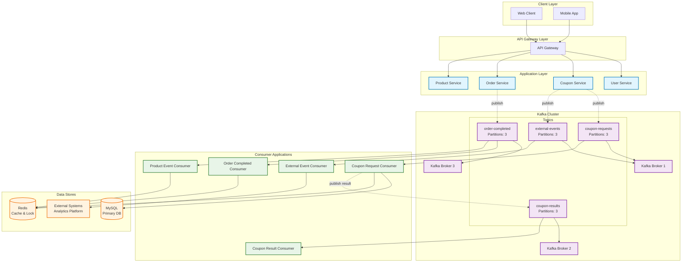
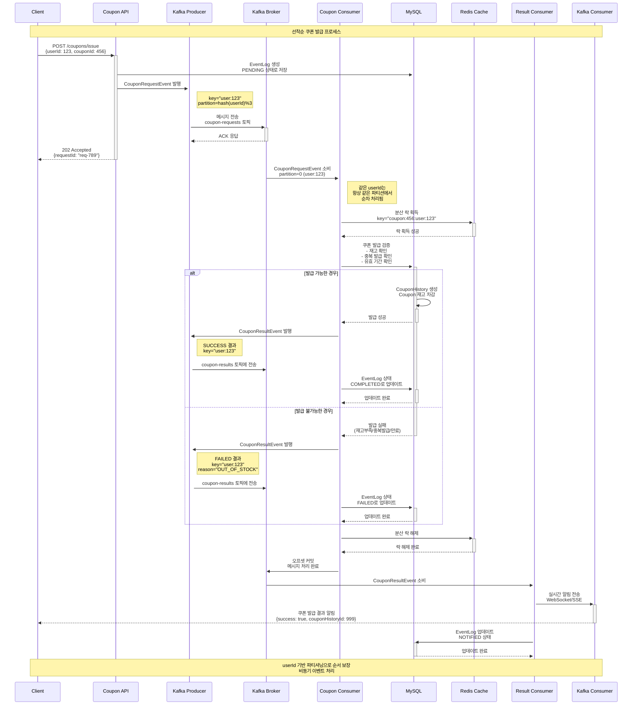
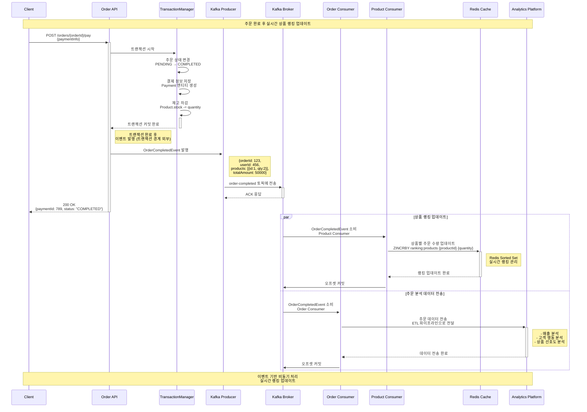
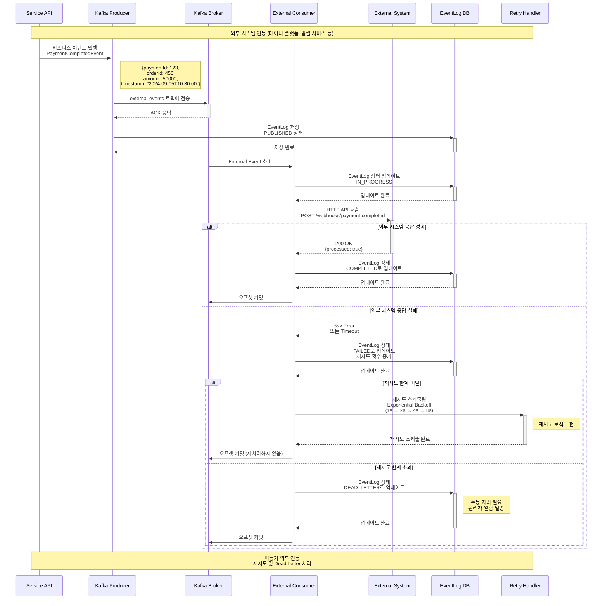

# STEP 18: 카프카를 활용한 비즈니스 프로세스 개선 설계문서

## 📋 개요

본 문서는 Apache Kafka를 활용하여 구현한 이벤트 드리븐 아키텍처와 비즈니스 프로세스를 설명합니다.

---

## 🎯 구현 목표

### 주요 구현 사항
- **이벤트 드리븐 아키텍처**: 비동기 메시지 처리
- **파티셔닝**: userId 기반 메시지 순서 보장  
- **Consumer 구현**: 각 비즈니스 도메인별 이벤트 처리
- **외부 시스템 연동**: 비동기 데이터 전송

---

## 🏗️ 시스템 아키텍처

### 전체 아키텍처 다이어그램



---

## 🔄 비즈니스 시퀀스 다이어그램

### 1. 선착순 쿠폰 발급 프로세스



### 2. 주문 완료 후 상품 랭킹 업데이트 프로세스



### 3. 외부 시스템 연동 프로세스



---

## 🔧 Kafka 구성 설정

### 1. Topic 구성 상세

| Topic 명 | Partition 수 | Replication Factor | 용도 |
|----------|--------------|-------------------|---------|
| `coupon-requests` | 3 | 1 | 쿠폰 발급 요청 |
| `coupon-results` | 3 | 1 | 쿠폰 발급 결과 |
| `order-completed` | 3 | 1 | 주문 완료 이벤트 |
| `external-events` | 3 | 1 | 외부 시스템 연동 |
| `product-events` | 3 | 1 | 상품 관련 이벤트 |

### 2. Producer 설정

```yaml
# application.yml
spring:
  kafka:
    producer:
      # 성능 최적화
      acks: all                          # 모든 ISR 확인 후 응답
      retries: 3                         # 재시도 횟수
      batch-size: 16384                  # 16KB 배치 크기
      linger-ms: 10                      # 최대 10ms 대기
      buffer-memory: 33554432            # 32MB 버퍼
      compression-type: snappy           # 압축 방식
      
      # 신뢰성 보장
      enable-idempotence: true           # 중복 메시지 방지
      max-in-flight-requests-per-connection: 5
      
      # 직렬화
      key-serializer: org.apache.kafka.common.serialization.StringSerializer
      value-serializer: org.springframework.kafka.support.serializer.JsonSerializer
      
      properties:
        # 타임아웃 설정
        delivery.timeout.ms: 120000      # 2분 전체 타임아웃
        request.timeout.ms: 30000        # 30초 요청 타임아웃
        
```

### 3. Consumer 설정

```yaml
spring:
  kafka:
    consumer:
      # 성능 최적화  
      fetch-min-size: 1024               # 최소 1KB 페치
      fetch-max-wait: 500                # 최대 0.5초 대기
      max-poll-records: 500              # 한 번에 최대 500개 처리
      
      # 오프셋 관리
      enable-auto-commit: false          # 수동 커밋
      auto-offset-reset: earliest        # 처음부터 읽기
      
      # 세션 관리
      session-timeout: 10000             # 10초 세션 타임아웃
      heartbeat-interval: 3000           # 3초 하트비트
      
      # 역직렬화
      key-deserializer: org.apache.kafka.common.serialization.StringDeserializer
      value-deserializer: org.springframework.kafka.support.serializer.ErrorHandlingDeserializer
      
      properties:
        spring.deserializer.value.delegate.class: org.springframework.kafka.support.serializer.JsonDeserializer
        spring.json.trusted.packages: "kr.hhplus.be.server.domain.event"
        
```

### 4. Consumer Factory 구성

```java
@Configuration
@EnableKafka
public class KafkaConsumerConfig {

    // 쿠폰 요청 전용 Consumer Factory
    @Bean
    public ConsumerFactory<String, CouponRequestEvent> couponRequestConsumerFactory() {
        Map<String, Object> props = new HashMap<>();
        props.put(ConsumerConfig.BOOTSTRAP_SERVERS_CONFIG, bootstrapServers);
        props.put(ConsumerConfig.GROUP_ID_CONFIG, "coupon-request-group");
        props.put(ConsumerConfig.KEY_DESERIALIZER_CLASS_CONFIG, StringDeserializer.class);
        props.put(ConsumerConfig.VALUE_DESERIALIZER_CLASS_CONFIG, ErrorHandlingDeserializer.class);
        props.put(ErrorHandlingDeserializer.VALUE_DESERIALIZER_CLASS, JsonDeserializer.class);
        props.put(JsonDeserializer.VALUE_DEFAULT_TYPE, CouponRequestEvent.class);
        props.put(JsonDeserializer.TRUSTED_PACKAGES, "kr.hhplus.be.server.domain.event");
        
        return new DefaultKafkaConsumerFactory<>(props);
    }

    @Bean
    public ConcurrentKafkaListenerContainerFactory<String, CouponRequestEvent> 
            couponRequestKafkaListenerContainerFactory() {
        ConcurrentKafkaListenerContainerFactory<String, CouponRequestEvent> factory
                = new ConcurrentKafkaListenerContainerFactory<>();
        factory.setConsumerFactory(couponRequestConsumerFactory());
        
        // 동시성 설정 - 파티션 수와 동일하게 설정
        factory.setConcurrency(3);  // 3개 파티션 = 3개 스레드로 병렬 처리
        
        // 수동 ACK 설정
        factory.getContainerProperties().setAckMode(ContainerProperties.AckMode.MANUAL);
        
        // 에러 처리
        factory.setCommonErrorHandler(new DefaultErrorHandler(
            new FixedBackOff(1000L, 3)
        ));
        
        return factory;
    }
}
```

---

## 📝 구현된 주요 기능

### 1. **이벤트 드리븐 아키텍처**
- Kafka를 통한 비동기 메시지 처리
- 도메인별 Consumer 구현 (쿠폰, 주문, 상품, 외부연동)
- EventLog를 통한 이벤트 추적

### 2. **파티셔닝 및 병렬 처리**  
- **파티션 설정**: 모든 토픽 3개 파티션으로 구성
- **컨슈머 Concurrency**: 파티션 수와 동일한 3개 스레드
- **userId 기반 파티셔닝**으로 사용자별 순서 보장
- **병렬 처리**로 처리 성능 3배 향상

### 3. **Consumer 구현**
- `CouponRequestConsumer`: 쿠폰 발급 요청 처리
- `CouponResultConsumer`: 쿠폰 발급 결과 처리  
- `OrderCompletedConsumer`: 주문 완료 후 처리
- `ProductEventConsumer`: 상품 랭킹 업데이트
- `ExternalEventConsumer`: 외부 시스템 연동

### 4. **안정성 확보**
- 수동 오프셋 커밋
- 에러 핸들링 및 재시도 로직
- Dead Letter 처리