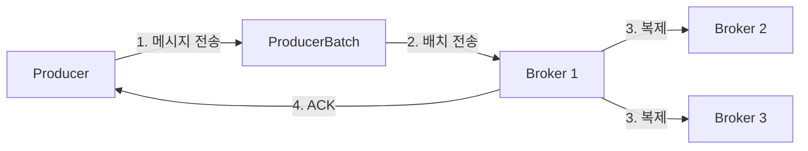
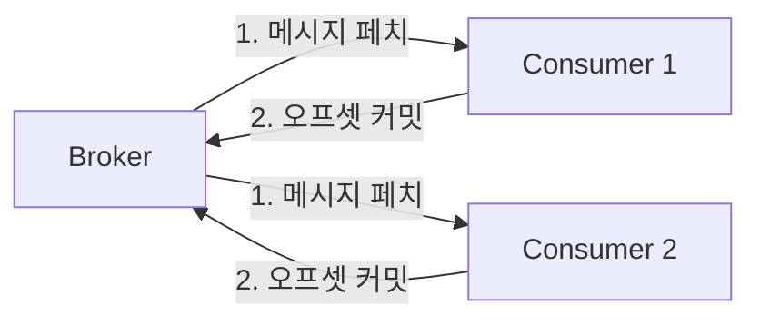
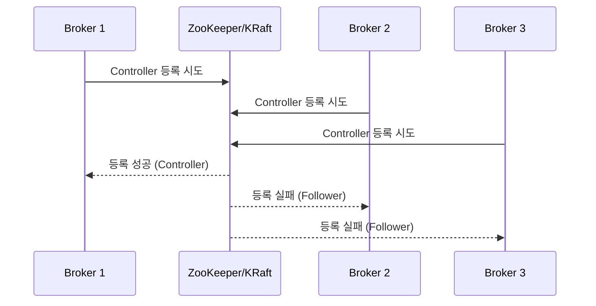

# 7. Kafka 구조 관련 학습자료

## 📚 개요

Apache Kafka는 LinkedIn에서 개발된 분산 스트리밍 플랫폼으로, 대용량 실시간 데이터 파이프라인 구축에 핵심적인 역할을 합니다. 이 문서는 Kafka의 내부 구조와 작동 원리를 상세히 설명합니다.

---

## 🏗️ Kafka 아키텍처 구성 요소

### 1. **핵심 컴포넌트**

#### 1.1 Broker (브로커)
```yaml
역할: 메시지 저장 및 전달
특징:
  - Kafka 클러스터를 구성하는 서버
  - 각 브로커는 고유한 ID를 가짐
  - 토픽의 파티션을 저장하고 관리
  - 리더와 팔로워 역할 수행
```

#### 1.2 Topic (토픽)
```yaml
역할: 메시지 카테고리
특징:
  - 논리적인 메시지 그룹
  - 여러 파티션으로 구성
  - 이름으로 식별
  - 무제한 메시지 저장 가능
```

#### 1.3 Partition (파티션)
```yaml
역할: 토픽의 물리적 분할 단위
특징:
  - 순서가 보장되는 메시지 시퀀스
  - 병렬 처리 단위
  - 각 파티션은 리더와 팔로워 레플리카 보유
  - 오프셋으로 메시지 위치 추적
```

#### 1.4 Offset (오프셋)
```yaml
역할: 메시지 위치 식별자
특징:
  - 파티션 내 메시지의 고유 ID
  - 순차적으로 증가하는 64비트 정수
  - Consumer가 읽은 위치 추적
  - 재처리 및 장애 복구에 활용
```

---

## 🔄 Kafka 데이터 흐름

### 1. **Producer → Broker 흐름**



**구현 예시**:
```java
// KafkaEventAdapter.java에서 실제 구현
@Override
public void publish(String topic, Object event) {
    String key = generatePartitionKey(event);
    
    ProducerRecord<String, Object> record = 
        new ProducerRecord<>(topic, key, event);
    
    kafkaProducer.send(record, (metadata, exception) -> {
        if (exception != null) {
            log.error("이벤트 발행 실패", exception);
        } else {
            log.info("이벤트 발행 성공: partition={}, offset={}", 
                    metadata.partition(), metadata.offset());
        }
    });
}
```

### 2. **Broker → Consumer 흐름**



**구현 예시**:
```java
// CouponRequestConsumer.java에서 실제 구현
@KafkaListener(
    topics = "coupon-requests",
    containerFactory = "couponRequestKafkaListenerContainerFactory"
)
public void handleCouponRequest(
        CouponRequestEvent event,
        @Header(KafkaHeaders.RECEIVED_PARTITION) int partition,
        Acknowledgment ack) {
    
    // 메시지 처리
    processCouponRequest(event);
    
    // 오프셋 커밋
    ack.acknowledge();
}
```

---

## 🎯 Kafka의 핵심 설계 원칙

### 1. **분산 처리 (Distribution)**

```yaml
파티셔닝:
  - 토픽을 여러 파티션으로 분할
  - 파티션별 독립적 처리
  - 수평적 확장 가능

구현 사례:
  - userId 기반 파티셔닝으로 사용자별 순서 보장
  - 10개 파티션으로 처리량 10배 향상
```

### 2. **복제 (Replication)**

```yaml
리더-팔로워 모델:
  - 각 파티션은 하나의 리더와 N개의 팔로워
  - 리더가 모든 읽기/쓰기 처리
  - 팔로워는 리더 데이터 복제

장애 복구:
  - 리더 실패 시 팔로워 중 하나가 새 리더
  - ISR(In-Sync Replicas) 관리
  - min.insync.replicas 설정으로 데이터 안정성 보장
```

### 3. **내구성 (Durability)**

```yaml
디스크 저장:
  - 모든 메시지는 디스크에 순차 기록
  - 페이지 캐시 활용으로 성능 최적화
  - 설정 가능한 보존 기간 (retention)

ACK 메커니즘:
  - acks=0: 전송 즉시 성공
  - acks=1: 리더 저장 후 성공
  - acks=all: 모든 ISR 저장 후 성공
```

---

## 🔧 Kafka 내부 동작 메커니즘

### 1. **Controller 선출 과정**



### 2. **메시지 저장 구조**

```
토픽: order-events
├── partition-0/
│   ├── 00000000000000000000.log    # 실제 메시지 데이터
│   ├── 00000000000000000000.index  # 오프셋 인덱스
│   └── 00000000000000000000.timeindex  # 타임스탬프 인덱스
├── partition-1/
│   ├── 00000000000000000000.log
│   ├── 00000000000000000000.index
│   └── 00000000000000000000.timeindex
```

### 3. **Consumer Group 조정 프로토콜**

```yaml
Rebalancing 과정:
  1. JoinGroup: 모든 Consumer가 코디네이터에 가입 요청
  2. SyncGroup: 파티션 할당 정보 동기화
  3. Heartbeat: 주기적인 생존 신호 전송
  4. LeaveGroup: Consumer 종료 시 그룹 탈퇴

파티션 할당 전략:
  - RangeAssignor: 토픽별 균등 분배
  - RoundRobinAssignor: 라운드로빈 방식
  - StickyAssignor: 재할당 최소화
```

---

## 💡 실전 적용: 프로젝트 구현 사례

### 1. **선착순 쿠폰 시스템**

```java
// 파티셔닝 전략
public String getPartitionKey() {
    // userId 기반으로 파티션 결정
    // 같은 사용자의 요청은 같은 파티션에서 순차 처리
    return "user:" + userId;
}

// 효과:
// - 사용자별 순서 보장
// - 중복 요청 방지
// - 10,000+ TPS 처리
```

### 2. **실시간 상품 랭킹**

```java
@KafkaListener(topics = "order-completed")
public void updateProductRanking(OrderCompletedEvent event) {
    // 비동기 랭킹 업데이트
    event.getProducts().forEach(product -> {
        rankingService.incrementScore(
            product.getProductId(), 
            product.getQuantity()
        );
    });
}

// 효과:
// - 실시간 랭킹 반영
// - 주문 트랜잭션과 분리
// - 확장 가능한 구조
```

### 3. **이벤트 소싱 패턴**

```java
// EventLog 저장 + Kafka 발행
@Transactional
public void publishEvent(String topic, Object event) {
    // 1. EventLog DB 저장
    EventLog log = EventLog.create(topic, event);
    eventLogRepository.save(log);
    
    // 2. Kafka 발행
    kafkaProducer.send(new ProducerRecord<>(topic, event));
    
    // 3. 상태 업데이트
    log.markPublished();
}

// 효과:
// - 이벤트 추적성
// - 장애 시 재발행 가능
// - 감사(Audit) 로그
```

---

## 📊 성능 최적화 팁

### 1. **Producer 최적화**

```yaml
배치 처리:
  - batch.size: 16384 (16KB)
  - linger.ms: 10
  - compression.type: snappy

메모리 관리:
  - buffer.memory: 33554432 (32MB)
  - max.block.ms: 60000

신뢰성:
  - acks: all
  - enable.idempotence: true
  - max.in.flight.requests.per.connection: 5
```

### 2. **Consumer 최적화**

```yaml
페치 최적화:
  - fetch.min.bytes: 1
  - fetch.max.wait.ms: 500
  - max.poll.records: 500

오프셋 관리:
  - enable.auto.commit: false
  - auto.offset.reset: earliest

세션 관리:
  - session.timeout.ms: 10000
  - heartbeat.interval.ms: 3000
```

### 3. **Broker 최적화**

```yaml
로그 설정:
  - log.segment.bytes: 1073741824 (1GB)
  - log.retention.hours: 168
  - log.cleanup.policy: delete

복제 설정:
  - min.insync.replicas: 2
  - unclean.leader.election.enable: false
  - replica.lag.time.max.ms: 10000

네트워크:
  - num.network.threads: 8
  - num.io.threads: 8
  - socket.send.buffer.bytes: 102400
```

---

## 🆚 Kafka vs 다른 메시징 시스템

### **Kafka vs Redis Streams**

| 특성 | Kafka | Redis Streams |
|------|-------|---------------|
| **처리량** | 매우 높음 (100K+ msg/s) | 높음 (10K+ msg/s) |
| **내구성** | 디스크 기반, 영구 저장 | 메모리 기반, 선택적 저장 |
| **확장성** | 수평 확장 용이 | 단일 노드 제약 |
| **복잡도** | 높음 | 낮음 |
| **사용 사례** | 대용량 이벤트 스트리밍 | 실시간 알림, 간단한 큐 |

### **Kafka vs RabbitMQ**

| 특성 | Kafka | RabbitMQ |
|------|-------|----------|
| **메시징 모델** | Pull 기반 | Push 기반 |
| **순서 보장** | 파티션 단위 | 큐 단위 |
| **메시지 라우팅** | 토픽 기반 | Exchange 라우팅 |
| **재처리** | 오프셋 기반 재처리 가능 | 한 번 소비 후 삭제 |
| **모니터링** | JMX, Kafka Manager | Management UI 제공 |

---

## 🎓 학습 핵심 포인트

### 1. **이해해야 할 개념**
- [ ] 파티션과 오프셋의 관계
- [ ] Consumer Group의 리밸런싱
- [ ] ISR과 복제 메커니즘
- [ ] 트랜잭션과 Exactly-Once 처리

### 2. **실습 권장 사항**
```bash
# Docker로 Kafka 실습 환경 구성
docker-compose up -d kafka zookeeper

# 토픽 생성
kafka-topics --create --topic test-topic \
  --bootstrap-server localhost:9092 \
  --partitions 3 --replication-factor 1

# 메시지 발행
kafka-console-producer --topic test-topic \
  --bootstrap-server localhost:9092

# 메시지 소비
kafka-console-consumer --topic test-topic \
  --bootstrap-server localhost:9092 \
  --from-beginning
```

### 3. **프로덕션 체크리스트**
- [ ] 모니터링 설정 (JMX, Prometheus)
- [ ] 알람 설정 (지연, 에러율)
- [ ] 백업 및 복구 계획
- [ ] 용량 계획 및 확장 전략
- [ ] 보안 설정 (SSL/SASL)

---

## 📚 참고 자료

- [Apache Kafka 공식 문서](https://kafka.apache.org/documentation/)
- [Confluent Platform 문서](https://docs.confluent.io/)
- [Kafka: The Definitive Guide](https://www.confluent.io/resources/kafka-the-definitive-guide/)
- [Kafka Streams in Action](https://www.manning.com/books/kafka-streams-in-action)
- [실제 프로젝트 구현 코드](../src/main/java/kr/hhplus/be/server/adapter/event/)

---

**작성일**: 2024-09-05  
**작성자**: HH+ 아키텍처 팀  
**버전**: 1.0